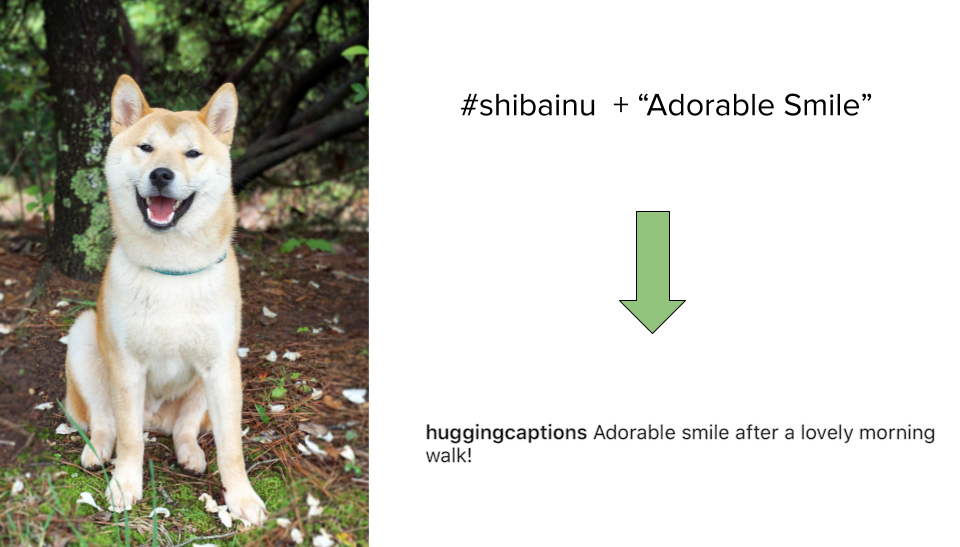

<div align="center">
  
  
</div>
<br>
<div align="center">
  <a href="https://www.instagram.com/p/CBZE6gwg_h7/?igshid=8olu6kun06k4">
        
  </a>  
</div>
<br>
<p align="center">
    <a href="https://www.instagram.com/huggingcaptions/">
        
    </a>
    <a href="https://github.com/antoninodimaggio/Hugging-Captions/blob/master/LICENSE">
        
    </a>
    <a href="https://www.python.org/">
        
    </a>
    
</p>

<p align="center">
    <a href="https://github.com/antoninodimaggio/Hugging-Captions">
        
    </a>
    <a href="https://twitter.com/tonyjdimaggio">
        
    </a>
</p>

## Introduction

Hugging Captions fine-tunes [GPT-2](https://openai.com/blog/better-language-models/), a transformer-based language model by [OpenAI](https://openai.com/), to generate realistic photo captions. All of the transformer stuff is implemented using [Hugging Face's Transformers library](https://github.com/huggingface/transformers), hence the name Hugging Captions.
## Setup
**Required**
* Python 3.6 +
* CUDA 10.2 ([Instructions](https://pytorch.org/get-started/locally/) for installing PyTorch on 9.2 or 10.1)
* If you are having issues installing the requirements for the project it most likely has something to do with CUDA
```
git clone https://github.com/antoninodimaggio/Hugging-Captions.git
cd Hugging-Captions
pip install -r requirements.txt
```
## Download Training Data
* It is important that you choose a hashtag that has more than 10,000 posts and is relevant to the photo you want to generate a caption for
* Detailed information on each argument can be found [here](docs/DOCS.md)
* You could also use python `python download.py -h` for help
```
python download.py --tag shibainu \
    --caption-queries 60 \
    --min-likes 10
```
## Training and Generating Captions
### Train
* Now that we have our training data we can train (fine-tune) our transformer-based language model. The model will train fast on a decent GPU.
```
python tune_transformer.py --tag shibainu --train
```
### Generate Captions
* The most important argument is `--prompt`, you want too lead your model in the right direction, the more specific the better.
* Detailed information on each argument can be found [here](docs/DOCS.md)
* You could also use `python tune_transformer.py  -h` for help
```
python tune_transformer.py --tag shibainu --generate \
    --prompt Adorable\ smile
    --max-length 60 \
    --min-length 20 \
    --num-captions 40
```
### Train and Generate Captions
* Trains and generates captions all in one go
```
python tune_transformer.py --tag shibainu --train --generate \
    --prompt Adorable\ smile
    --max-length 60 \
    --min-length 20 \
    --num-captions 40
```
## See Your Results
* Navigate to `/Hugging-Captions/text/generated_text/<tag>_gen.txt` to look at your generated captions
### My Results Are Not What I Expected
Some of the generated captions are going to be ugly. Some of the generated captions are going to be really good but a word or two simply does not make sense. This is expected no matter how much the data, both training and generated, is cleaned. If you are not getting the results that you want I have four suggestions.
1. **Choose a better hashtag.** If you are captioning a photo of a dog do not choose #dog instead try #poodle, #bulldog, and so on.
2. **Make your prompt more specific.** A prompt like "My day" is very general and will lead to general results, instead try something like "My Saturday morning".
3. **Increase your number of captions.** The default is 40, bump that up to 80.
4. **Increase the number of caption queries.** The default is 60, raise that to say 100.
## Future Work
* Explore ways to better clean caption data both generated and training
* Explore different pre-trained language models
* Fine-tune models using caption data from multiple relevant hashtags
